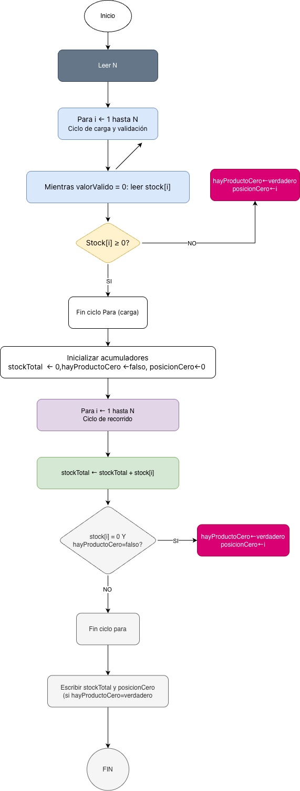
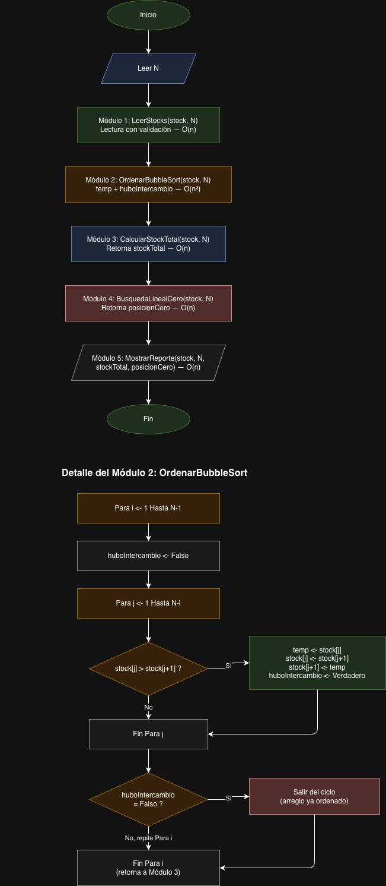

# algoritmos-q1
Pseudocódigo y Algoritmos Q1 - Ingenieria en Sistemas - Universida Uk

## Contenido
- Unidad 1: Introducción a los algoritmos
- Unidad 2: Estructuras de decisión
- Unidad 3: Estructuras de ciclos (PARA, MIENTRAS, HACER-MIENTRAS)
- Unidad 4: Arreglos y matrices

## Herramientas
Pseudocódigo en español neutro, sin lenguaje de programación especifico.

## Autor
Luis Manuel Rodriguez Martinez - Q1 2026

# Evaluación Semana 2 - Algoritmos
## pseudocódigo Muestra el control de stock de una tienda Online

##ALGORITMO ControlStockProductos

VARIABLES
    N              : ENTERO
    i              : ENTERO
    stock          : ARREGLO[N] DE ENTERO
    stockTotal     : ENTERO
    valorValido    : ENTERO
    hayProductoCero: LOGICO
    posicionCero   : ENTERO
INICIO
 ESCRIBIR "Ingrese la cantidad de productos (N):"
 LEER N
 // --- Carga y Validación de arreglo ---

 PARA i ← 1 HASTA N HACER
        valorValido ← 0
        MIENTRAS valorValido = 0 HACER
            ESCRIBIR "Ingrese el stock del producto ", i, ": "
            LEER stock[i]
            SI stock[i] >= 0 ENTONCES
                valorValido ← 1
            SINO
                ESCRIBIR "Valor inválido. El stock no puede ser negativo."
            FIN SI
        FIN MIENTRAS
    FIN PARA
  
   // --- Inicialización de acumuladores ---
    stockTotal      ← 0
    hayProductoCero ← FALSO
    posicionCero    ← 0 
 
  //--- Recorrido del arreglo ---
  
  PARA i ← 1 HASTA N HACER
    stockTotal ← stockTotal + stock[i]
     SI stock[i] = 0 Y hayProductoCero = FALSO ENTONCES
            hayProductoCero ← VERDADERO
            posicionCero    ← i
        FIN SI
    FIN PARA

// --- resultados y calculos ---

ESCRIBIR "Stock total disponible:", stockTotal

SI hayProductoCero = VERDADERO ENTONCES
 ESCRIBIR "Se encontro un producto con stck 0 en la posicion:", posicionCero
SINO
 ESCRIBIR "No hay productos con stock 0"

 FIN

 ##Diagrama de flujo
 
    
 ##Tabla de trazado — Control de stock de productos
## Datos de prueba

- N = 5
- stock = [15, 8, 0, 23, 5]

## Ciclo de carga y validación

| Iteración (i) | Valor leído (stock[i]) | ¿stock[i] ≥ 0? | valorValido |
|:---:|:---:|:---:|:---:|
| 1 | 15 | Sí | Verdadero |
| 2 | 8  | Sí | Verdadero |
| 3 | 0  | Sí | Verdadero |
| 4 | 23 | Sí | Verdadero |
| 5 | 5  | Sí | Verdadero |

// ---Ejercicios semana 3---

# algoritmos-q1
Pseudocódigo y Algoritmos Q1 - Ingenieria en Sistemas - Universida Uk
# Evaluación Semana 3 - Algoritmos
## pseudocódigo Muestra el control de stock de una tienda Online

 ALGORITMO ControlStockProductos

VARIABLES
    N              : ENTERO
    stock          : ARREGLO[N] DE ENTERO
    stockTotal     : ENTERO
    posicionCero   : ENTERO

// =========================================================
// MÓDULO 1: Lectura con validación (in-place)
// =========================================================
PROCEDIMIENTO LeerStocks (ENT/SAL stock : ARREGLO[N] DE ENTERO, ENT N : ENTERO)
VARIABLES
    i           : ENTERO
    valorValido : LOGICO
INICIO
    PARA i ← 1 HASTA N HACER
        valorValido ← FALSO
        MIENTRAS valorValido = FALSO HACER
            ESCRIBIR "Ingrese el stock del producto ", i, ": "
            LEER stock[i]
            SI stock[i] >= 0 ENTONCES
                valorValido ← VERDADERO
            SINO
                ESCRIBIR "Valor inválido. El stock no puede ser negativo."
            FIN SI
        FIN MIENTRAS
    FIN PARA
FIN PROCEDIMIENTO

// =========================================================
// MÓDULO 2: Ordenamiento Bubble Sort (in-place)
// =========================================================
PROCEDIMIENTO OrdenarBubbleSort (ENT/SAL stock : ARREGLO[N] DE ENTERO, ENT N : ENTERO)
VARIABLES
    i, j, temp      : ENTERO
    huboIntercambio : LOGICO
INICIO
    PARA i ← 1 HASTA N - 1 HACER
        huboIntercambio ← FALSO
        PARA j ← 1 HASTA N - i HACER
            SI stock[j] > stock[j + 1] ENTONCES
                temp        ← stock[j]
                stock[j]    ← stock[j + 1]
                stock[j+1]  ← temp
                huboIntercambio ← VERDADERO
            FIN SI
        FIN PARA
        SI huboIntercambio = FALSO ENTONCES
            SALIR // arreglo ya ordenado, corta antes de tiempo
        FIN SI
    FIN PARA
FIN PROCEDIMIENTO

// =========================================================
// MÓDULO 3: Cálculo del stock total
// =========================================================
FUNCION CalcularStockTotal (ENT stock : ARREGLO[N] DE ENTERO, ENT N : ENTERO) : ENTERO
VARIABLES
    i     : ENTERO
    total : ENTERO
INICIO
    total ← 0
    PARA i ← 1 HASTA N HACER
        total ← total + stock[i]
    FIN PARA
    RETORNAR total
FIN FUNCION

// =========================================================
// MÓDULO 4: Búsqueda lineal del primer producto con stock 0
// =========================================================
FUNCION BusquedaLinealCero (ENT stock : ARREGLO[N] DE ENTERO, ENT N : ENTERO) : ENTERO
VARIABLES
    i         : ENTERO
    posicion  : ENTERO
    encontrado: LOGICO
INICIO
    posicion   ← -1
    encontrado ← FALSO
    i          ← 1
    MIENTRAS i <= N Y encontrado = FALSO HACER
        SI stock[i] = 0 ENTONCES
            posicion   ← i
            encontrado ← VERDADERO
        FIN SI
        i ← i + 1
    FIN MIENTRAS
    RETORNAR posicion
FIN FUNCION

// =========================================================
// MÓDULO 5: Mostrar reporte final
// =========================================================
PROCEDIMIENTO MostrarReporte (ENT stock : ARREGLO[N] DE ENTERO, ENT N : ENTERO,
                               ENT stockTotal : ENTERO, ENT posicionCero : ENTERO)
VARIABLES
    i : ENTERO
INICIO
    ESCRIBIR "===== REPORTE DE STOCK ====="
    ESCRIBIR "Arreglo ordenado:"
    PARA i ← 1 HASTA N HACER
        ESCRIBIR "Producto ", i, ": ", stock[i]
    FIN PARA
    ESCRIBIR "Stock total disponible: ", stockTotal
    SI posicionCero <> -1 ENTONCES
        ESCRIBIR "Producto con stock 0 encontrado en la posición: ", posicionCero
    SINO
        ESCRIBIR "No hay productos con stock 0."
    FIN SI
FIN PROCEDIMIENTO

// =========================================================
// ALGORITMO PRINCIPAL
// =========================================================
INICIO
    ESCRIBIR "Ingrese la cantidad de productos (N): "
    LEER N
    LeerStocks(stock, N)
    OrdenarBubbleSort(stock, N)
    stockTotal   ← CalcularStockTotal(stock, N)
    posicionCero ← BusquedaLinealCero(stock, N)
    MostrarReporte(stock, N, stockTotal, posicionCero)
FIN   

##análisis de complejidad Big O

MóduloComplejidadJustificaciónLeerStocks (lectura con validación)O(n)Un solo ciclo PARA recorre los N elementos una vez. El ciclo MIENTRAS interno de validación no depende de N: solo repite si el usuario ingresa un valor inválido, no escala con el tamaño del arreglo.OrdenarBubbleSortO(n²)Dos ciclos PARA anidados: el externo recorre N-1 veces y el interno hasta N-i veces. En el peor caso (arreglo en orden inverso) se realizan aproximadamente N×N comparaciones.CalcularStockTotalO(n)Un único ciclo PARA que recorre el arreglo una sola vez, acumulando la suma. El trabajo crece linealmente con N.BusquedaLinealCeroO(n)En el peor caso (no hay producto con stock 0, o está en la última posición) el ciclo MIENTRAS recorre los N elementos completos.MostrarReporteO(n)Contiene un ciclo PARA que imprime cada uno de los N elementos del arreglo ordenado, además de operaciones de impresión constantes.Algoritmo principalO(n²)La complejidad total está determinada por el módulo más costoso: aunque la mayoría de los módulos son O(n), OrdenarBubbleSort domina el crecimiento total del sistema.

  ##Diagrama de flujo
 
    
